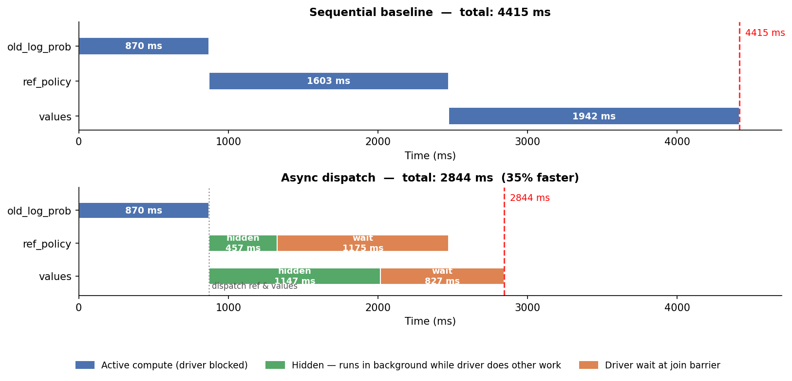

### 4.2 Asynchronous Pipelining and Overlap

We introduce non-blocking dispatch for preparation-stage workers (ref policy,
critic, reward model), allowing their GPU execution to overlap with other
driver-side compute. We measure overlap via `hidden_frac = hidden_ms / in_flight_ms`,
where `hidden_ms` is the portion of each worker's execution that ran concurrently
with other work.

**Table 1.** Prep-stage latency, sequential vs. async
(2×V100-32GB, Qwen2.5-1.5B, GSM8K, 20 steps, p50).

| Stage          | Serial (ms) | Async wait (ms) | Hidden (ms) | hidden_frac |
|----------------|------------:|----------------:|------------:|------------:|
| `old_log_prob` | 870         | 870             | 0           | 0.000       |
| `ref_policy`   | 1603        | 1175            | 457         | 0.285       |
| `values`       | 1942        | 827             | 1147        | 0.590       |
| **Total**      | **4415**    | **2872**        | **1604**    | **0.363**   |

*Serial = each stage run sequentially (in_flight_ms).
Async wait = actual driver blocking time.
Hidden = execution overlapped with concurrent work.*

Key findings:
- **35% prep-stage speedup**: 3 stages async (2844 ms) < 2 stages sequential (4415 ms)
- `ref_policy`: 28.5% of execution hidden under `old_log_prob`
- `values`: 59% of execution hidden under ref-join wait — nearly free
- Adding a critic forward pass costs **zero extra critical-path time**
  because it is fully pipelined with ref

**Figure 1.** Execution timeline comparison (Gantt chart).

*Top: sequential baseline — each stage waits for the previous one (total 4415 ms).
Bottom: async dispatch — ref_policy and values are dispatched simultaneously after
old_log_prob, running in the background (green) while the driver does other work.
The driver only blocks at the join barrier (orange). Total: 2844 ms.*