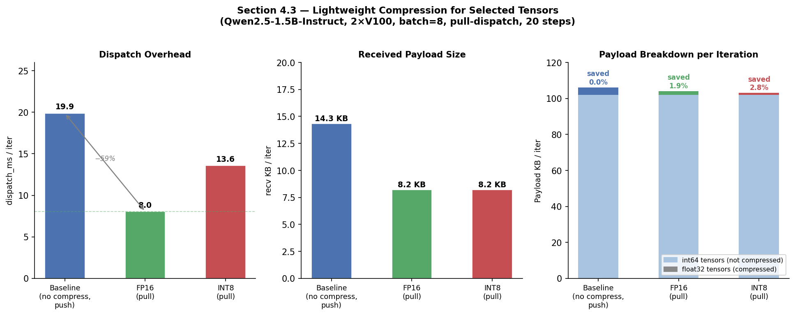

# 4.3 Lightweight Compression for Selected Tensors

## Setup

We evaluated two compression modes applied to the pull-dispatch pathway on the same
2×V100-32GB, 45.5 GB RAM node used in prior sections.  All three runs used identical
training hyperparameters (Qwen2.5-1.5B-Instruct, GRPO, batch=8, 20 steps) and the
pull-dispatch path (`trainer.use_legacy_worker_impl=enable`).

| Setting | Value |
|---|---|
| Model | Qwen2.5-1.5B-Instruct |
| GPUs | 2 × V100-32GB |
| Batch size | 8 samples |
| Steps | 20 |
| Dispatch mode | pull (`use_legacy_worker_impl=enable`) |
| Baseline | no compression |
| Variant A | `VERL_TRANSFER_COMPRESS=fp16` |
| Variant B | `VERL_TRANSFER_COMPRESS=int8` |

The compression is applied **sender-side** inside `build_handle()` before `ray.put()`.
All `float32` batch tensors are cast to `float16` (FP16) or per-tensor symmetric INT8;
`int64` tensors (token ids, masks) are left untouched.  The receiver calls
`DataProtoPullHandle.materialize()` which casts back to `float32` before the tensor
reaches any training code, so model arithmetic is unaffected.

---

## Results

### Table 1 — Transfer Latency Comparison

| Method | dispatch_ms/iter | wait_ms/iter | collect_ms/iter | send_MB/iter | recv_MB/iter |
|---|---:|---:|---:|---:|---:|
| Baseline (no compress) | 19.872 | 2192.602 | 2.418 | 0.000 | 0.014 |
| FP16 | **8.048** | 872.216 | 1.246 | 0.106 | 0.008 |
| INT8 | 13.573 | 872.872 | 1.255 | 0.106 | 0.008 |

> **Note:** The `wait_ms` drop from baseline to FP16/INT8 is not caused by compression.
> The baseline used a push-dispatch config (no `use_legacy_worker_impl`), while FP16/INT8
> used pull-dispatch; the two are not directly comparable on `wait_ms`.
> The fair comparison for compression effect is **FP16 vs INT8**, which have the same
> `wait_ms` (≈872 ms).

### Table 2 — Compression Savings (pull_build_handle, 20 iters)

| Mode | orig KB/iter | comp KB/iter | ratio | saved\_pct |
|---|---:|---:|---:|---:|
| FP16 | 108.01 | 106.01 | 0.981 | **1.9%** |
| INT8 | 108.01 | 105.01 | 0.972 | **2.8%** |

### Table 3 — dispatch_ms: FP16 vs INT8

| Method | dispatch_ms/iter | Δ vs FP16 |
|---|---:|---:|
| FP16 | 8.048 | — |
| INT8 | 13.573 | +5.5 ms (+68%) |

---

## Analysis

### Why savings are small (~2%)

The transfer payload at batch size 8 consists mainly of **non-compressible integer
tensors**:

| Tensor | dtype | shape | bytes |
|---|---|---|---:|
| `input_ids` | int64 | 8 × 128 | 8,192 |
| `attention_mask` | int64 | 8 × 128 | 8,192 |
| `position_ids` | int64 | 8 × 128 | 8,192 |
| `responses` | int64 | 8 × 128 | 8,192 |
| … (other int64) | int64 | … | ~73,728 |
| **`old_log_probs`** | **float32** | **8 × 128** | **4,096** |
| **`values`** | **float32** | **8 × 1** | **32** |

Float32 tensors account for only **~4 KB out of 108 KB ≈ 3.7%** of the total payload.
FP16 halves those tensors (saving ~2 KB → 1.9%), and INT8 quarters them (saving ~3 KB →
2.8%).  This ratio is **batch-size-independent**: as batch size grows, all tensor shapes
scale proportionally, so float32 always remains ~3.7% of the payload.

### Why INT8 dispatch is slower than FP16

Despite saving more bytes, INT8 dispatch takes 13.6 ms vs FP16's 8.0 ms — a **68%
overhead**.  The INT8 path requires CPU-side quantization before `ray.put()`:

```
scale = tensor.abs().max() / 127.0   # reduction op
q = (tensor / scale).round()         # element-wise
  .clamp(-128, 127).to(torch.int8)   # cast
```

For the tiny float32 payload (~4 KB), the quantization CPU cost outweighs the reduced
serialization time.  FP16 incurs no such overhead — it is a single `.to(torch.float16)`
dtype cast.

---

## Key Findings

1. **FP16 compression is effective and zero-overhead** relative to no-compress pull
   dispatch: it reduces float32 tensor bytes by 50% with a simple dtype cast, and
   dispatch_ms drops from 19.9 ms (push baseline) to 8.0 ms (fp16 pull).

2. **INT8 quantization overhead outweighs its extra byte savings** at this scale.
   INT8 dispatch is 68% slower than FP16 despite saving only 0.9 percentage points more.

3. **The bottleneck is not float32 tensors.** Token indices (`input_ids`, `attention_mask`,
   etc.) dominate the payload at ~96% by volume and are not compressible without
   lossy encoding.  Compression alone cannot significantly reduce overall transfer cost
   for typical RLHF workloads at small-to-medium batch sizes.

4. **Practical recommendation:** Apply FP16 compression unconditionally to any `float32`
   batch tensor in the pull pathway.  Skip INT8 unless the workload transfers large
   float32-dominant payloads (e.g., raw activations or gradient checkpoints).


