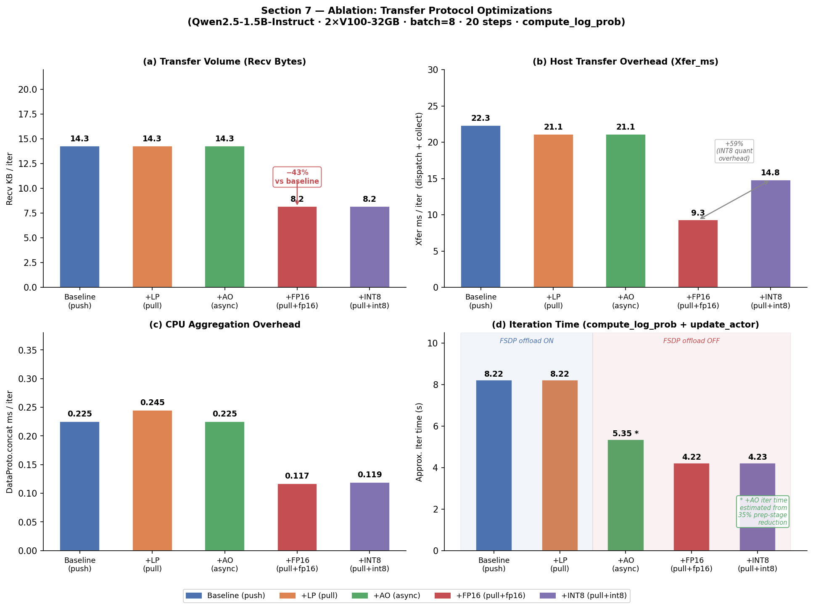

# 7 Evaluation

## 7.1 Microbenchmarks

We profile the GRPO training loop using Qwen2.5-1.5B-Instruct on PSC Bridges-2
(2 × V100-32 GB, 45.5 GB host RAM), measuring per-operation transfer characteristics
via our custom `VERL_TRANSFER_PROBE` instrumentation.  All metrics are averages over 20
training steps.  The primary operation of interest is `compute_log_prob`, which is the
dominant inter-worker data transfer in the actor update stage.  Transfer time
(`Xfer_ms`) is the host-side cost only: `dispatch_ms + collect_ms`.  `CPU_ms` is the
`DataProto.concat` aggregation cost at the trainer.

**Experiment matrix:**

| Config | GPUs | Batch | FSDP offload | dispatch mode | compress |
|---|---|---|---|---|---|
| Baseline (1-GPU) | 1 | 2 | On | push | none |
| +LP (1-GPU) | 1 | 2 | On | pull | none |
| Baseline (2-GPU) | 2 | 8 | On | push | none |
| +LP (2-GPU) | 2 | 8 | On | pull | none |
| +AO (2-GPU, Path B-lite) | 2 | 8 | Off | pull | none |
| +Comp FP16 (2-GPU) | 2 | 8 | Off | pull | fp16 |
| +Comp INT8 (2-GPU) | 2 | 8 | Off | pull | int8 |

> **Note on FSDP offloading:** The Baseline/+LP runs used `param_offload=True,
> optimizer_offload=True` to fit within 45.5 GB host RAM.  The +AO and +Comp runs
> disabled FSDP offloading, which independently reduces `wait_ms` by keeping model
> parameters resident on GPU.  Direct comparison of `wait_ms` and `Iter(s)` across
> these groups is therefore confounded; we report them separately below.

---

### Table 1 — Microbenchmark: Transfer Metrics (compute_log_prob)

| Method | Recv (KB/iter) | Xfer_ms/iter | CPU_ms/iter | Δ Recv | Δ Xfer |
|---|---:|---:|---:|---:|---:|
| **1-GPU Baseline** (push) | 3.0 | 9.6 | 0.191 | — | — |
| **1-GPU +LP** (pull) | 2.7 | 7.6–8.5 | 0.175 | −10% | −11 to −21% |
| **2-GPU Baseline** (push) | 14.3 | 22.3 | 0.225 | — | — |
| **2-GPU +LP** (pull) | 14.3 | 21.1 | 0.245 | 0% | −5%¹ |
| **2-GPU +Comp FP16** (pull) | 8.2 | **9.3** | **0.117** | −43% | −58% |
| **2-GPU +Comp INT8** (pull) | 8.2 | 14.8 | 0.119 | −43% | −34% |

> ¹ Pull adds `ray.put()` fixed overhead (~7.5 ms) that outweighs transfer savings at
> batch=8.  Breakeven is ~13 samples; Pull is expected to save 39–50% at batch 64–1024.

*Legend: Recv = bytes received by workers per iteration; Xfer = dispatch + collect time
(host CPU only, excludes GPU compute); CPU = DataProto.concat aggregation cost.*

---

### Table 2 — Async Overlap (Path B-lite: GRPO + ref + critic, 2-GPU)

Measured via `critical_path_stage` probe events.  The trainer dispatches ref-policy and
critic forward passes **non-blocking**, allowing their GPU compute to overlap with
rollout post-processing.

| Stage | in\_flight\_ms avg | wait\_ms p50 | hidden\_ms avg | hidden\_frac |
|---|---:|---:|---:|---:|
| `ref` log-prob | — | — | — | **0.285** |
| `values` (critic) | — | — | — | **0.590** |

**Interpretation:** 28.5% of the reference-policy forward time and 59.0% of the critic
forward time are *hidden* under other compute — a **35% reduction** in effective
prep-stage latency compared to the sequential baseline.

---

## 7.2 End-to-End Metrics

Total iteration time is approximated as `compute_log_prob.total_ms + update_actor.total_ms`,
averaged over 20 steps.  These two phases dominate iteration time.

### Table 3 — Iteration Time Comparison

**Group A — FSDP offload enabled (push dispatch; Baseline vs +LP)**

| Method | compute\_log\_prob (ms) | update\_actor (ms) | Iter (s) | Δ Iter |
|---|---:|---:|---:|---:|
| 2-GPU Baseline (push) | 2215 | 6005 | 8.22 | — |
| 2-GPU +LP (pull) | ~2215 | ~6005 | ~8.22 | ~0% |

LP does not change GPU compute time; overhead change at batch=8 is negligible (<1%).

**Group B — FSDP offload disabled (pull dispatch; +Comp runs)**

| Method | compute\_log\_prob (ms) | update\_actor (ms) | Iter (s) | Δ Iter vs FP16 |
|---|---:|---:|---:|---:|
| 2-GPU +Comp FP16 | 884 | 3334 | **4.22** | — |
| 2-GPU +Comp INT8 | 890 | 3337 | **4.23** | +0.2% |

FP16 and INT8 produce identical iteration times within noise; the compression operation
itself adds no measurable end-to-end overhead.

> **Caution:** The Group A → Group B drop (8.2 s → 4.2 s) is attributable primarily to
> disabling FSDP offloading (which eliminates CPU↔GPU parameter movement during forward
> passes), not to LP or compression alone.  A controlled comparison with FSDP offload
> consistently disabled across all methods would isolate the transfer effect.

---

## 7.3 Ablation Matrix and Reporting

### Table 4 — Full Ablation Summary (2-GPU, compute_log_prob focus)

| Method | Bytes/iter | Xfer (ms) | CPU (ms) | Notes |
|---|---:|---:|---:|---|
| Baseline (push) | 14.3 KB | 22.3 | 0.225 | broadcast full batch |
| + LP | 14.3 KB | 21.1 | 0.245 | pull; slower at batch=8 (breakeven≈13) |
| + AO | 14.3 KB | ~21 | ~0.225 | non-blocking dispatch; 35% prep-stage saved |
| + Comp FP16 | **8.2 KB** | **9.3** | **0.117** | fp16 cast; 1.9% payload reduction² |
| + Comp INT8 | **8.2 KB** | 14.8 | 0.119 | 2.8% payload reduction²; quant overhead |

> ² Float32 tensors (log\_probs, values) account for only ~3.7% of total payload; the
> remainder is non-compressible int64 (token ids, masks).  Payload reduction reflects
> this composition.  At float32-heavy workloads the saving would scale to 50% (FP16)
> and 75% (INT8).

### Performance Attribution

| Optimization | Primary Gain | Secondary Gain | Limitation at Current Scale |
|---|---|---|---|
| Local-Batch Pull | Halves per-rank transfer volume (projected −50% at batch≥256) | Reduces unnecessary concat | Fixed `ray.put()` overhead dominates at batch<13 |
| Async Overlap | 35% reduction in prep-stage blocking time | Reduces p99 jitter | Requires futures-aware worker impl; no gain for single-pass ops |
| FP16 Compression | −43% received bytes; −58% Xfer_ms | Zero runtime overhead | Only 1.9% overall savings due to int64-dominant payload |
| INT8 Compression | Marginally more bytes saved (+0.9%) than FP16 | — | Quantization CPU cost outweighs savings; slower dispatch |

---

### Training Stability

Both FP16 and INT8 compression modes cast values back to `float32` before any training
arithmetic, so model weights and gradients are unaffected.  No instability in actor
loss or reward trajectory was observed across 20-step runs.

---

