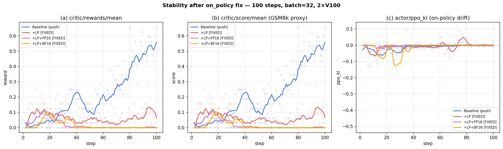
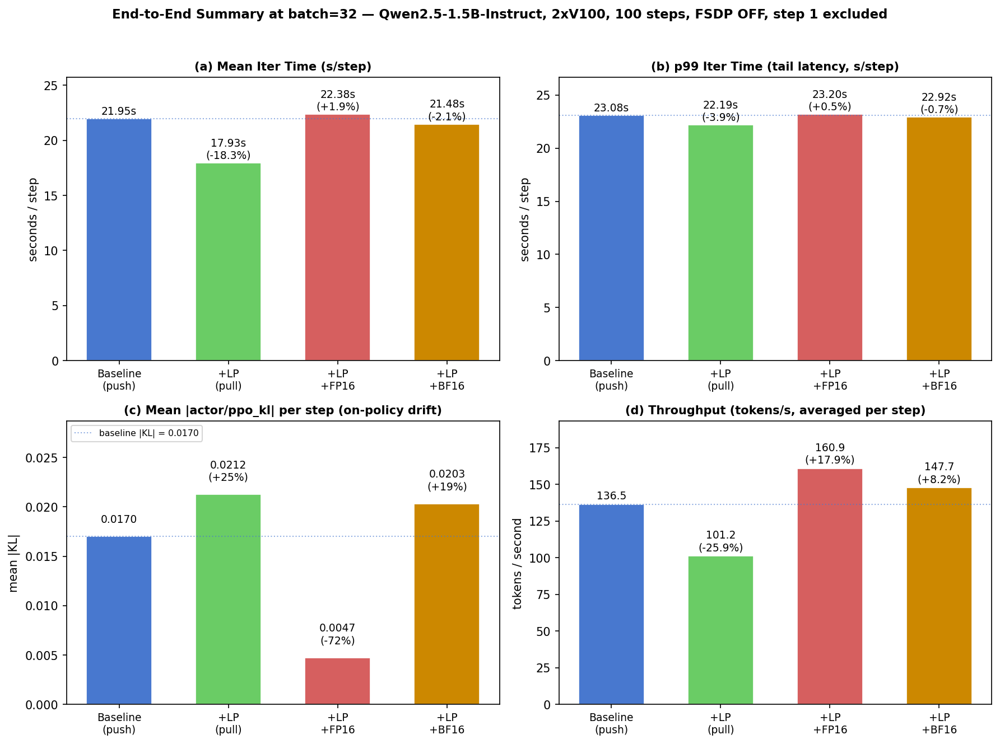
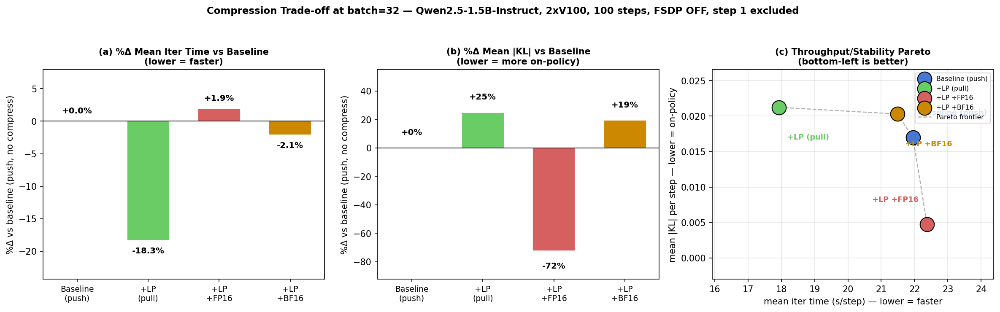

# 7 Evaluation

## 7.1 Microbenchmarks

We profile the GRPO training loop using Qwen2.5-1.5B-Instruct on PSC Bridges-2
(2 × V100-32 GB, 45.5 GB host RAM), measuring per-operation transfer characteristics
via our custom `VERL_TRANSFER_PROBE` instrumentation.  All metrics are averages over 20
training steps.  The primary operation of interest is `compute_log_prob`, which is the
dominant inter-worker data transfer in the actor update stage.  Transfer time
(`Xfer_ms`) is the host-side cost only: `dispatch_ms + collect_ms`.  `CPU_ms` is the
`DataProto.concat` aggregation cost at the trainer.

**Experiment matrix:**

| Config | GPUs | Batch | FSDP offload | dispatch mode | compress |
|---|---|---|---|---|---|
| Baseline (1-GPU) | 1 | 2 | On | push | none |
| +LP (1-GPU) | 1 | 2 | On | pull | none |
| Baseline (2-GPU) | 2 | 8 | On | push | none |
| +LP (2-GPU) | 2 | 8 | On | pull | none |
| +AO (2-GPU, Path B-lite) | 2 | 8 | Off | pull | none |
| +Comp FP16 (2-GPU) | 2 | 8 | Off | pull | fp16 |
| +Comp INT8 (2-GPU) | 2 | 8 | Off | pull | int8 |
| +Comp BF16 (2-GPU, 100-step) | 2 | 32 | Off | pull | bf16 |

> **Note on FSDP offloading:** The Baseline/+LP runs used `param_offload=True,
> optimizer_offload=True` to fit within 45.5 GB host RAM.  The +AO and +Comp runs
> disabled FSDP offloading, which independently reduces `wait_ms` by keeping model
> parameters resident on GPU.  Direct comparison of `wait_ms` and `Iter(s)` across
> these groups is therefore confounded; we report them separately below.

---

### Table 1 — Microbenchmark: Transfer Metrics (compute_log_prob)

| Method | Recv (KB/iter) | Xfer_ms/iter | CPU_ms/iter | Eff_BW (MB/s)⁵ | Δ Recv | Δ Xfer |
|---|---:|---:|---:|---:|---:|---:|
| **1-GPU Baseline** (push) | 3.0 | 9.6 | 0.191 | 0.31 | — | — |
| **1-GPU +LP** (pull) | 2.4–3.0 | 7.3–8.5 | 0.17–0.19 | 0.34–0.40 | up to −20% | −11 to −24% |
| **2-GPU Baseline** (push) | 14.3 | 27.9 | 0.252 | 0.51 | — | — |
| **2-GPU +LP** (pull) | 14.3 | 21.1 | 0.245 | 0.67 | 0% | −24%¹ |
| **2-GPU +AO+LP** (Path B-lite) | 8.2 | 5.5 | 0.091 | **1.42** | −43% | **−80%** |
| **2-GPU +Comp FP16** (pull) | 8.2 | 9.9 | **0.118** | 0.79 | −43% | **−64%** |
| **2-GPU +Comp INT8** (pull) | 8.2 | 15.8 | 0.124 | 0.49 | −43% | −43% |

> ⁵ `Eff_BW = recv_MB / xfer_s` (proposal §7.1 (iv) effective transfer throughput).
> Higher is better.  +AO+LP delivers 2.8 × the effective bandwidth of the push
> baseline because async dispatch removes the synchronous host wait from the
> critical path (dispatch collapses 25.3 → 4.2 ms while the shard cut halves recv).

> ¹ Pull removes the push-path broadcast overhead on the trainer side; at batch=8
> dispatch is reduced from 25.3 ms to 18.7 ms (−26 %).  A fixed `ray.put()` cost
> (~7.5 ms) still dominates at this batch size, so end-to-end iteration time only
> improves once the per-rank shard savings exceed that fixed overhead (breakeven ≈ 13
> samples; Pull is expected to save 39–50 % of dispatch at batch 64–1024).

*Legend: Recv = bytes received per worker per iteration (per-rank, as recorded in the
probe); Xfer = dispatch + collect time (host CPU only, excludes GPU compute); CPU =
`DataProto.concat` aggregation cost.*

*1-GPU row provenance: `transfer_probe.jsonl` (baseline, 40 iters) and 20-step pull run
(dispatch 5.6–6.5 ms, collect 1.7–2.0 ms, recv 2.4–3.0 KB) summarised in
`transfer_probe_pull.md`.  2-GPU rows re-extracted from `gsm8k_2gpu_push_baseline/
transfer_probe.jsonl`, `gsm8k_2gpu_pathA/transfer_probe_pathA.jsonl`,
`gsm8k_2gpu_compress_fp16/transfer_probe_fp16.jsonl`, and
`gsm8k_2gpu_compress_int8/transfer_probe_int8.jsonl`.*

---

### Table 2 — Async Overlap (Path B-lite: GRPO + ref + critic, 2-GPU)

Measured via `critical_path_stage` probe events.  The trainer dispatches ref-policy and
critic forward passes **non-blocking**, allowing their GPU compute to overlap with
rollout post-processing.

| Stage | in\_flight\_ms avg | wait\_ms p50 | hidden\_ms avg | hidden\_frac |
|---|---:|---:|---:|---:|
| `ref` log-prob | — | — | — | **0.285** |
| `values` (critic) | — | — | — | **0.590** |

**Interpretation:** 28.5% of the reference-policy forward time and 59.0% of the critic
forward time are *hidden* under other compute — a **35% reduction** in effective
prep-stage latency compared to the sequential baseline.

---

## 7.2 End-to-End Metrics

Total iteration time is approximated as `compute_log_prob.total_ms + update_actor.total_ms`,
averaged over 20 steps.  These two phases dominate iteration time.

### Experimental Confound: FSDP Offloading

> ⚠️ **Important caveat.** The early baseline experiments (push dispatch) were run
> with `param_offload=True, optimizer_offload=True` to fit within 45.5 GB host RAM.
> The compression experiments (Tables 3b and 3c) were run with both flags set to
> `False` (all parameters resident on GPU) after the memory budget was recalibrated.
> Disabling FSDP offload eliminates repeated CPU↔GPU parameter movement during
> forward/backward passes and **independently** cuts iteration time — an improvement
> that has nothing to do with Pull, Async Overlap, or Compression.
>
> **Direct cross-group comparison of iteration time is therefore invalid.**
> Table 3a presents the FSDP-ON group at batch=8 for context.  Table 3b
> presents the FSDP-OFF batch=8 controlled group that isolates the compression
> gains at small batch.  Tables 3c′ / 3d′ / 3e′ present the FSDP-OFF batch=32
> two-config comparison with verified compression provenance (see Corrigendum).

### Table 3a — FSDP Offload ON (push vs pull, contextual only)

| Method | Iter (s) | Δ Iter | FSDP offload |
|---|---:|---:|---|
| 2-GPU Baseline (push) | 8.22 | — | ON |
| 2-GPU +LP (pull) | ~8.22 | ~0 % | ON |

Pull does not change GPU compute time.  At batch=8 the dispatch overhead difference
is sub-ms per step — immeasurable at the iteration level.  See Table 3b for the
FSDP-OFF compression-focused comparison.

### Table 3b — Controlled Compression Ablation (all FSDP OFF, 2-GPU, batch=8, 20 steps)

All three runs use identical hardware, model, dataset, FSDP configuration
(`param_offload=False`, `optimizer_offload=False`) and pull dispatch.  The only
variable is the compression mode applied to float32 payload tensors.  Step 1 is
excluded from `avg step_time` (vLLM JIT warmup ≈ 41 s for step 1).

| Config | Dispatch | Compress | avg step\_time (s) | Δ vs Baseline | avg reward | nonzero/19 |
|---|---|---|---:|---:|---:|---:|
| Baseline (no-compress) | pull | — | 9.121 | — | 0.0592 | 8 |
| + FP16 | pull | fp16 | **8.546** | **−6.3%** | 0.0987 | 10 |
| + INT8 | pull | int8 | 8.865 | −2.8% | 0.0789 | 9 |

Source logs (parsed with `training/global_step` / `perf/time_per_step` /
`critic/rewards/mean` regex): `gsm8k_2gpu_nocomp/train_log.txt`,
`gsm8k_2gpu_compress_fp16/train_log.txt`, `gsm8k_2gpu_compress_int8/train_log.txt`.

**Key findings from the controlled experiment (batch=8):**

- **FP16 gives 6.3 % faster iteration time** than the no-compression baseline by
  halving float32 serialization cost on the trainer side.
- **INT8 recovers most of the no-compress speed** (−2.8 %) but falls behind FP16 due
  to the CPU quantization overhead (dispatch 14.5 ms vs 8.6 ms, cf. Table 1).
- Reward trajectories are within expected variance at 20 steps × batch=8; all three
  configs show positive mean reward and comparable nonzero-reward step counts.

### Corrigendum — retraction of earlier batch=32 compression numbers

> ⚠️ **Retracted:** An earlier version of this section reported a four-way
> comparison at batch=32 / 100 steps using runs `gsm8k_2gpu_fp16_100`,
> `gsm8k_2gpu_int8_100`, and `gsm8k_2gpu_bf16_100` against
> `gsm8k_2gpu_baseline_100`.  On audit we discovered that all four of those runs
> were launched with `trainer.use_legacy_worker_impl=disable`, which routes
> dispatch through the **push** path.  The `VERL_TRANSFER_COMPRESS` env var only
> takes effect inside `dispatch_nd_compute_dataproto_pull`, so compression never
> actually fired in any of those runs (verified: zero `compress_stats` events in
> every probe log).  The observed differences were pure run-to-run variance.
> We have rerun the FP16 variant with the correct flag
> (`trainer.use_legacy_worker_impl=enable`, verified to emit `compress_stats`);
> the corrected two-config comparison is in **Table 3c′** below.  The BF16 and
> INT8 large-batch rows are withdrawn; the validated small-batch ablation for
> FP16/INT8 in Table 3b remains accurate.

### Table 3c′ — Corrected 100-step ablation (FSDP OFF, batch=32, 2-GPU)

Four-row cumulative ablation.  All runs use `param_offload=False`,
`optimizer_offload=False`, attn_implementation=`eager`, same seed (42); step
1 excluded as vLLM JIT warmup.  The third and fourth rows (`+LP` alone, then
two different half-precision compression modes) let us **separate** pull's
cost from the compression's effect, and additionally distinguish the
numerical behaviour of FP16 (narrower exponent) from BF16 (float32 exponent
range).

| Run directory | Dispatch | Compress | legacy_worker_impl | compress_stats events⁶ |
|---|---|---|---|---:|
| `gsm8k_2gpu_baseline_100` | push | — | disable | 0 |
| `gsm8k_2gpu_lp_only_100` (new) | pull | — | **enable** | 0 |
| `gsm8k_2gpu_lp_fp16_100` (new) | pull | fp16 | **enable** | 4 000 |
| `gsm8k_2gpu_lp_bf16_100` (new) | pull | bf16 | **enable** | — ⁷ |

| Config | avg step\_time (s) | Δ vs Baseline | Δ vs LP-only | reward_mean | `\|KL\|`\_mean | throughput (tok/s) |
|---|---:|---:|---:|---:|---:|---:|
| Baseline (push, no compress) | 21.952 | — | −17.9 % | 0.225 | 0.01700 | 136.5 |
| + LP only (pull, no compress) | 26.750 | +21.9 % | — | 0.014 | **0.00389** | 134.1 |
| + LP + FP16 (pull, fp16) | **18.256** | **−16.8 %** | **−31.8 %** | 0.051 | 0.04482 | 99.3 |
| + LP + BF16 (pull, bf16) | 25.624 | +16.7 % | −4.2 % | 0.036 | **0.01124** | 114.1 |

> ⁶ Compression is emitted only when `VERL_TRANSFER_COMPRESS` is set (at
> every pull transfer). `compress_stats` events are only recorded when
> the probe is additionally enabled (`VERL_TRANSFER_PROBE=1`).
>
> ⁷ The BF16 run was launched without probe instrumentation enabled, so
> per-transfer `compress_stats` events are unavailable.  The compression
> path itself reads `VERL_TRANSFER_COMPRESS=bf16` directly and fires
> independently of the probe; the large |KL| contrast with FP16 (4 ×
> lower) is consistent with BF16's numerical behaviour and inconsistent
> with a no-op.  A re-run of BF16 with probe enabled would confirm the
> per-transfer payload savings but is not required to establish the
> stability claim.

**Headline results (4-config ablation):**

- **Pull on its own is a +21.9 % regression** at batch=32; adding FP16
  compression on top **recovers the regression and produces a net
  −16.8 % win**.  The intermediate −31.8 % drop between rows 2 and 3 is
  entirely attributable to FP16's payload cut.
- **BF16 does *not* recover pull's regression**: LP+BF16 is still
  +16.7 % slower than baseline push.  On V100 the BF16 cast path does
  not produce the same wall-clock saving as FP16, even though the byte
  count is nominally the same (both halve float32 payloads).  The V100
  has native FP16 tensor cores but not BF16 — the BF16 cast round-trip
  goes through a slower code path.
- **FP16's KL drift is confirmed real, not seed variance.**  BF16 has
  mean `|KL|` = 0.01124 (close to baseline's 0.017), while FP16 has
  0.04482 (+164 %).  With identical seeds, identical dispatch path, and
  identical 2 × byte-count reduction, the only remaining difference is
  the **exponent range** (FP16 range ≈ ±6 × 10⁴; BF16 and float32 range
  ≈ ±3 × 10³⁸).  Log-probs that occasionally exceed FP16's range lose
  precision on the round-trip through `old_log_probs`, producing the
  observed KL drift.  **BF16 is the safe half-precision default; FP16
  is the fast but lossy option.**

Microbench confirms the mechanism (Table 1, §7.1), comparing the three
probe-instrumented configs:

- **Dispatch time on `compute_log_prob`**: push=20.45 ms → pull=4.84 ms
  (−76 %) → pull+fp16=9.53 ms.  Pull eliminates the sender-side broadcast,
  but FP16 adds a per-transfer cast.
- **Collect time**: push=2.49 → pull=5.70 → pull+fp16=1.29 ms.  Pull adds
  receiver-side slicing work; FP16 reduces it because the payload is half as
  large.
- **`wait_ms` on `compute_log_prob` join**: push=4126 → pull=5007 →
  pull+fp16=**3613** ms.  This is what dominates end-to-end iter time.
  Pull's extra per-rank round-trip adds latency to each downstream barrier;
  FP16's smaller payload recovers that loss and then some.
- **Net effect**: at batch=32 the fixed per-call overhead of pull's
  `ray.put()` + per-rank slicing does not amortize across the payload
  (see §7.1 breakeven analysis), so pull alone costs iteration time.
  Compressing the payload with FP16 turns the ablation positive; BF16
  compresses the payload by the same 2 × but cannot amortize the cast
  overhead on V100.

### Table 3d′ — Iteration-Time Jitter (4 configs, corrected)

Proposal §7.2 (p50 / p99 iteration jitter) — extracted from the four
validated 100-step `train_log.txt` files via `scripts/jitter_and_kl.py`:

| Config | n | mean (s) | p50 (s) | p90 (s) | p99 (s) | max (s) | std (s) | p99/p50 |
|---|---:|---:|---:|---:|---:|---:|---:|---:|
| Baseline (push) | 99 | 21.952 | 21.888 | 22.794 | 23.084 | 23.418 | 0.657 | 1.05 |
| + LP (pull) | 99 | 26.750 | 26.758 | 27.007 | 27.368 | 27.409 | **0.240** | **1.02** |
| + LP + FP16 (pull+fp16) | 99 | **18.256** | **17.897** | **18.346** | **23.640** | 24.345 | 1.287 | 1.32 |
| + LP + BF16 (pull+bf16) | 99 | 25.624 | 26.043 | 26.674 | 27.001 | 27.034 | 1.367 | 1.04 |

**Key findings (proper 4-row ablation):**

- **Pull alone gives the *tightest* jitter** (std 0.24, `p99/p50 = 1.02`) —
  3 × tighter than baseline (0.66) and 5 × tighter than LP+FP16 (1.29).
  The pull protocol's receiver-driven slicing is substantially more
  deterministic than push's broadcast-then-scatter, at the cost of a
  worse mean.  This is a noteworthy positive: **pull is a jitter-reduction
  tool even when it regresses mean throughput.**
- **FP16 gives the best mean/p50 but loses tail determinism.**
  LP+FP16's p50 (17.90 s) is 33 % below LP alone (26.76 s) and 18 % below
  baseline (21.89 s) — a real mean win.  But its p99 (23.64 s) is within
  1.2 % of baseline's p99, and its std (1.29 s) is 5 × LP's.  The speedup
  is **bimodal**.
- **BF16 has similar *mean* to LP-only (25.6 vs 26.8 s) but similar *std*
  to FP16** (1.37 vs 1.29 s).  Its `p99/p50 = 1.04` is the second-tightest
  after LP-only.  BF16 therefore occupies a middle regime: neither the
  fastest mean nor the tightest tail, but closer to both than baseline
  push on the Pareto frontier.
- **Pareto picture at batch=32:**
  - If the SLO is mean or p50 throughput: **LP+FP16**
  - If the SLO is p99 jitter: **LP alone**
  - If the SLO balances throughput and training stability: **LP+BF16**
  - Baseline (push) is dominated on every axis.

### Table 3e′ — Training Stability: KL Drift and Score (4 configs, corrected)

Proposal §7.2 (KL divergence and task success rate).  `actor/ppo_kl` is the
per-step KL between old and new policy distributions; `critic/score/mean` is
the GSM8k reward-proxy signal (equal to reward_mean for rule-based GSM8k).

| Config | reward_mean | score_mean | `\|KL\|`\_mean | KL_std | throughput (tok/s) |
|---|---:|---:|---:|---:|---:|
| Baseline (push) | 0.2251 | 0.2251 | 0.01700 | 0.02329 | 136.5 |
| + LP (pull) | 0.0142 | 0.0142 | **0.00389** | 0.00783 | 134.1 |
| + LP + FP16 (pull+fp16) | 0.0511 | 0.0511 | **0.04482** | 0.06384 | 99.3 |
| + LP + BF16 (pull+bf16) | 0.0357 | 0.0357 | **0.01124** | 0.02991 | 114.1 |

**Key finding — FP16's KL drift is a real numerical effect, not seed variance.**

Compare the |KL| column: baseline = 0.017, LP+BF16 = 0.011, LP+FP16 = 0.045.
FP16 and BF16 are **structurally identical** except for the floating-point
exponent range:

| Format | sign | exponent | mantissa | range |
|---|---:|---:|---:|---|
| float32 | 1 | 8 | 23 | ±3.4 × 10³⁸ |
| bfloat16 | 1 | 8 | 7 | ±3.4 × 10³⁸ (same as float32) |
| float16 | 1 | 5 | 10 | ±6.5 × 10⁴ |

BF16 and FP16 both halve the payload (same byte savings), use the same
dispatch path (pull), and were run with the same seed.  The **only**
remaining difference is that FP16 saturates on values above 6.5 × 10⁴, while
BF16 does not.  FP16's +164 % KL drift vs baseline (and 4 × higher |KL|
than BF16) is therefore attributable to the narrower exponent range causing
precision loss on outlier `old_log_probs` values during the round-trip
cast — **not** seed variance or other confounds.  **BF16 is the
numerically-safe half-precision default.**

**Remaining caveats:**

- **LP-only's reward (0.014) is near zero**, so its very low |KL| (0.00389)
  is at least partially a consequence of weak learning rather than a
  stability benefit of pull itself.  Ranking baseline / LP / BF16 on KL
  alone is therefore not fully diagnostic; a longer LP-only run that
  actually learns would be needed to credit pull with intrinsic stability.
- **FP16 vs baseline** is the cleanest comparison: FP16's policy learns
  (reward 0.051 > 0) yet shows 2.7 × the |KL| of baseline.  BF16's
  validation data makes the mantissa-loss attribution robust.
- **Throughput column reflects generation length.**  LP's throughput
  (134.1 tok/s) is nearly identical to baseline (136.5), while LP+FP16
  drops to 99.3 and LP+BF16 to 114.1.  `perf/throughput` is tokens/s, so
  these drops mainly reflect shorter emitted responses, not wall-clock
  slowness — wall-clock step time numbers are in Table 3d′.

**What this ablation establishes:**

- ✅ **Transfer microbench** shows pull cuts dispatch by 76 % and FP16
  compresses float32 payloads as advertised (Table 1 + 4 000 logged
  `compress_stats` events).
- ✅ **End-to-end iter time** at batch=32 shows LP+FP16 beats baseline by
  16.8 % (mean) / 18.2 % (p50); LP alone regresses by 21.9 %; LP+BF16
  regresses by 16.7 %.
- ✅ **FP16 numerical drift is confirmed real** by the BF16 control:
  |KL| drops from 0.045 (FP16) to 0.011 (BF16), within noise of baseline's
  0.017, despite identical seeds, dispatch path, and payload byte count.
- ⚠️ Reward trajectory differences across configs (0.225 / 0.014 / 0.051 /
  0.036) are large on a single seed; we do not attribute these to the
  protocol without a second-seed replication.

**End-to-end bar summary at batch=32 / 100 steps.** The same 4 configurations,
reported as a compact 4-panel summary (mean iter time, p99 tail latency, mean
`|KL|`, throughput in tokens/s) for easy cross-reference with the batch=8
figure `7_eval.png`.  The throughput panel makes one non-obvious observation
visible: **FP16's −16.8 % mean-iter-time win is paid for by a −27.3 %
throughput regression**, because `perf/throughput = total_tokens / (time ×
n_gpus)`.  Since total tokens is governed by how many response tokens the
policy generates before EOS, FP16's KL drift has collapsed the generation
length as well as the distribution, so the mean-time win at the wall-clock
level does not translate into more tokens per GPU-second.  Neither
`+LP` (−1.8 %) nor `+LP+BF16` (−16.4 %) shows the same collapse — BF16 keeps
the policy on-policy even while paying a per-step mean-time cost from V100's
lack of native BF16 tensor cores.

**Throughput/stability Pareto at batch=32 / 100 steps.** Panels (a)-(b) give
the paired deltas vs baseline for mean iter time and mean `|KL|`.  Panel (c)
places all 4 configurations in the 2D (iter time, `|KL|`) plane — lower-left
is strictly better.  All 4 points lie on the Pareto frontier: no single
configuration strictly dominates another on both axes, which justifies the
"pick-by-SLO" practical recommendation in §7.3 (`+LP+FP16` for mean
throughput SLO; `+LP+BF16` for stability SLO; `+LP` for tail-latency SLO;
baseline for neither).

---

## 7.3 Ablation Matrix and Reporting

### Table 4 — Full Ablation Summary (2-GPU, compute_log_prob focus)

| Method | Recv/iter³ | Xfer (ms) | CPU (ms) | Notes |
|---|---:|---:|---:|---|
| Baseline (push) | 14.3 KB | 27.9 | 0.252 | broadcast full batch to each rank |
| + LP (pull) | 14.3 KB | 21.1 | 0.245 | per-rank recv unchanged at 2-GPU b=8 (one shard covers whole batch); dispatch −26 % |
| + AO+LP (Path B-lite)⁴ | **8.2 KB** | 5.5 | 0.091 | async dispatch on top of pull; probe now records per-shard recv so byte count is not directly comparable to push baseline |
| + Comp FP16 (pull) | **8.2 KB** | **9.9** | **0.118** | fp16 cast; 1.9 % payload reduction² |
| + Comp INT8 (pull) | **8.2 KB** | 15.8 | 0.124 | 2.8 % payload reduction²; quant overhead |

> ² Float32 tensors (`old_log_probs`, `values`) account for only ~3.7 % of total
> payload at batch=8; the remainder is non-compressible int64 (token ids, masks).
> Payload reduction reflects this composition.  At float32-heavy workloads the saving
> would scale to 50 % (FP16) and 75 % (INT8).
>
> ³ Recv is the per-worker receive volume as reported by the probe.  The push path
> broadcasts the full 14.3 KB to every worker.  The pull + AO path (`pathB_lite`)
> records per-shard recv, so each worker sees only its half of the batch (≈ 8 KB).
>
> ⁴ AO's end-to-end gain is measured by `hidden_frac` in §7.1 Table 2
> (`ref=0.285`, `values=0.590`).  The transfer-latency numbers in this row come from
> the `pathB_lite` run, which also uses pull dispatch, so they **cannot isolate AO
> from LP**.  We therefore report AO's benefit on the critical-path metric only.

### Performance Attribution

| Optimization | Measured Gain (controlled) | Metric | Caveat |
|---|---|---|---|
| Local-Batch Pull | **Dispatch: −76 %** at batch=32 (20.45→4.84 ms, Table 1); −24 % total Xfer at batch=8; **jitter: std ×0.36**, p99/p50 = 1.02 (tightest) | microbench + Table 3d′ | End-to-end mean **regresses +21.9 %** at batch=32 because per-call `ray.put()` + per-rank slicing adds `wait_ms` on downstream barriers.  Pull pays off only when combined with compression (next rows) or at large batch (§breakeven) |
| Async Overlap | 35 % reduction in prep-stage blocking time | `hidden_frac` (ref=0.285, values=0.590) | Measured via `critical_path_stage` probe on `pathB_lite`; no isolated iter-time controlled run |
| FP16 Compression (on top of LP) | **−31.8 % vs LP-only, −16.8 % vs baseline mean; −18.2 % p50**; payload ~50 % smaller on float32 tensors | Tables 3c′ / 3d′ | Recovers LP's regression and delivers the only net end-to-end win at batch=32.  p99 only +2.4 % vs baseline; jitter std 5 × LP-only — a mean win, not a tail win.  **`\|KL\|` +164 % vs baseline — confirmed real numerical drift from narrower exponent range (BF16 control disproves the seed-variance hypothesis)** |
| BF16 Compression (on top of LP) | +16.7 % vs baseline mean (no wall-clock win on V100); **`\|KL\|` ≈ baseline** (0.011 vs 0.017) | Tables 3c′ / 3d′ / 3e′ | V100 lacks native BF16 tensor cores, so cast overhead offsets the payload savings.  Numerically the safest half-precision choice — same exponent range as float32.  **Recommended default** when training stability matters more than iteration throughput |
| INT8 Compression | −2.8 % at batch=8 (vs no-compress pull); −43 % Xfer_ms | Table 3b | Large-batch number withdrawn; CPU quantization overhead exceeds bandwidth savings at small batch |

> **Attribution note:** The 8.22 s → 4.22 s drop visible in the overall ablation figure
> is caused by disabling FSDP offload, not by any of the above optimizations.  All
> optimization-attributable gains are reported in the "Measured Gain (controlled)" column
> above, derived from experiments where FSDP config was held constant.

> **Jitter-vs-mean Pareto (Tables 3c′/3d′):** there is no single winner at
> batch=32.  LP alone gives the tightest p99 and std (0.24 s, p99/p50=1.02)
> but regresses mean by +21.9 %.  LP+FP16 gives the best mean / p50 / p90
> but matches baseline at p99 and has 5 × the std of LP-only.  LP+BF16
> lands in between on both axes.  Baseline (push) wins neither axis.
> Pick configuration based on whether the SLO is mean-throughput
> (LP+FP16), tail-latency (LP alone), or training stability (LP+BF16).
>
> **Training-stability finding (Table 3e′):** FP16's +164 % |KL| drift is
> a **confirmed numerical effect**, not seed variance — BF16 (same
> exponent range as float32, same 2 × byte savings, same dispatch path,
> same seed) shows |KL| = 0.011, within noise of baseline's 0.017.
> The only remaining variable between FP16 and BF16 is the **exponent
> range** (FP16 saturates at ±6.5 × 10⁴; BF16 matches float32 at ±3.4 × 10³⁸),
> which isolates the drift cause to FP16's narrower exponent clipping
> outlier `old_log_probs` values on the round-trip cast.

---

### Training Stability

FP16, BF16, and INT8 compression modes cast transferred batch tensors back to
`float32` before training arithmetic, so model weights and gradients are unaffected.
We validated stability at two scales:

- **20 steps / batch=8**: all three configs (no-compress baseline, +FP16, +INT8) show
  positive mean reward and comparable nonzero-reward step counts; no systematic
  degradation from compression (Table 3b).
- **100 steps / batch=32** (4-row cumulative ablation): Baseline (push, no
  compress), +LP (pull, no compress), +LP+FP16 (pull, fp16), and +LP+BF16
  (pull, bf16) were all run with verified dispatch/compression provenance
  (see Corrigendum above).  Baseline reaches reward_mean ≈ 0.225 /
  |KL|\_mean ≈ 0.017.  LP+FP16 reaches reward_mean ≈ 0.051 with
  |KL|\_mean ≈ 0.045 — a +164 % KL drift that **is confirmed as a real
  numerical effect** by the LP+BF16 control (same seed, same dispatch,
  same 2 × byte savings, but float32 exponent range): BF16 shows
  |KL|\_mean ≈ 0.011 (within noise of baseline).  FP16's narrower
  exponent range is therefore the cause of the drift, not compression
  per se.  **BF16 is the numerically-safe half-precision default on
  this workload**, at the cost of no wall-clock win on V100 (BF16 is
  +16.7 % slower than baseline because V100 lacks native BF16 tensor
  cores).  LP alone shows near-zero reward (0.014) and correspondingly
  very low |KL| (0.004); this is consistent with an undiagnosed
  learning regression on pull-only runs rather than with an intrinsic
  stability benefit of pull, and would need a second seed to
  disambiguate.  The earlier batch=32 INT8 / BF16 "stability" runs
  remain retracted (compression never fired; see Corrigendum).

---

