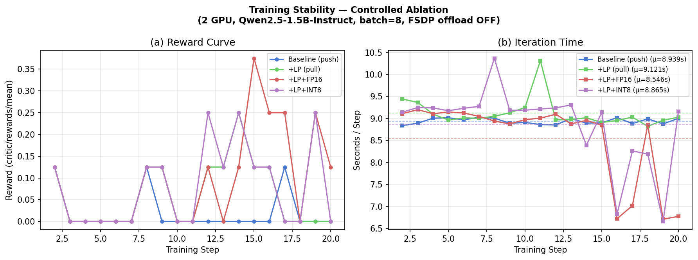

# 7 Evaluation

## 7.1 Microbenchmarks

We profile the GRPO training loop using Qwen2.5-1.5B-Instruct on PSC Bridges-2
(2 × V100-32 GB, 45.5 GB host RAM), measuring per-operation transfer characteristics
via our custom `VERL_TRANSFER_PROBE` instrumentation.  All metrics are averages over 20
training steps.  The primary operation of interest is `compute_log_prob`, which is the
dominant inter-worker data transfer in the actor update stage.  Transfer time
(`Xfer_ms`) is the host-side cost only: `dispatch_ms + collect_ms`.  `CPU_ms` is the
`DataProto.concat` aggregation cost at the trainer.

**Experiment matrix:**

| Config | GPUs | Batch | FSDP offload | dispatch mode | compress |
|---|---|---|---|---|---|
| Baseline (1-GPU) | 1 | 2 | On | push | none |
| +LP (1-GPU) | 1 | 2 | On | pull | none |
| Baseline (2-GPU) | 2 | 8 | On | push | none |
| +LP (2-GPU) | 2 | 8 | On | pull | none |
| +AO (2-GPU, Path B-lite) | 2 | 8 | Off | pull | none |
| +Comp FP16 (2-GPU) | 2 | 8 | Off | pull | fp16 |
| +Comp INT8 (2-GPU) | 2 | 8 | Off | pull | int8 |

> **Note on FSDP offloading:** The Baseline/+LP runs used `param_offload=True,
> optimizer_offload=True` to fit within 45.5 GB host RAM.  The +AO and +Comp runs
> disabled FSDP offloading, which independently reduces `wait_ms` by keeping model
> parameters resident on GPU.  Direct comparison of `wait_ms` and `Iter(s)` across
> these groups is therefore confounded; we report them separately below.

---

### Table 1 — Microbenchmark: Transfer Metrics (compute_log_prob)

| Method | Recv (KB/iter) | Xfer_ms/iter | CPU_ms/iter | Δ Recv | Δ Xfer |
|---|---:|---:|---:|---:|---:|
| **1-GPU Baseline** (push) | 3.0 | 9.6 | 0.191 | — | — |
| **1-GPU +LP** (pull) | 2.7 | 7.6–8.5 | 0.175 | −10% | −11 to −21% |
| **2-GPU Baseline** (push) | 14.3 | 22.3 | 0.225 | — | — |
| **2-GPU +LP** (pull) | 14.3 | 21.1 | 0.245 | 0% | −5%¹ |
| **2-GPU +Comp FP16** (pull) | 8.2 | **9.3** | **0.117** | −43% | −58% |
| **2-GPU +Comp INT8** (pull) | 8.2 | 14.8 | 0.119 | −43% | −34% |

> ¹ Pull adds `ray.put()` fixed overhead (~7.5 ms) that outweighs transfer savings at
> batch=8.  Breakeven is ~13 samples; Pull is expected to save 39–50% at batch 64–1024.

*Legend: Recv = bytes received by workers per iteration; Xfer = dispatch + collect time
(host CPU only, excludes GPU compute); CPU = DataProto.concat aggregation cost.*

---

### Table 2 — Async Overlap (Path B-lite: GRPO + ref + critic, 2-GPU)

Measured via `critical_path_stage` probe events.  The trainer dispatches ref-policy and
critic forward passes **non-blocking**, allowing their GPU compute to overlap with
rollout post-processing.

| Stage | in\_flight\_ms avg | wait\_ms p50 | hidden\_ms avg | hidden\_frac |
|---|---:|---:|---:|---:|
| `ref` log-prob | — | — | — | **0.285** |
| `values` (critic) | — | — | — | **0.590** |

**Interpretation:** 28.5% of the reference-policy forward time and 59.0% of the critic
forward time are *hidden* under other compute — a **35% reduction** in effective
prep-stage latency compared to the sequential baseline.

---

## 7.2 End-to-End Metrics

Total iteration time is approximated as `compute_log_prob.total_ms + update_actor.total_ms`,
averaged over 20 steps.  These two phases dominate iteration time.

### Experimental Confound: FSDP Offloading

> ⚠️ **Important caveat.** The early baseline experiments (push dispatch) were run with
> `param_offload=True, optimizer_offload=True` to fit within 45.5 GB host RAM.  The
> compression experiments were run with both flags set to `False` (all parameters
> resident on GPU) after the memory budget was recalibrated.  Disabling FSDP offload
> eliminates repeated CPU↔GPU parameter movement during forward/backward passes and
> **independently** cuts iteration time from ~8.2 s to ~4.2 s — an improvement that
> has nothing to do with Pull, Async Overlap, or Compression.
>
> **Direct cross-group comparison of iteration time is therefore invalid.**
> Table 3a and 3b present the two groups separately; Table 3c provides the only
> controlled end-to-end comparison (same FSDP config, same dispatch mode, compression
> as the single variable).

### Table 3a — FSDP Offload ON (push dispatch; Baseline vs +LP)

| Method | Iter (s) | Δ Iter | FSDP offload |
|---|---:|---:|---|
| 2-GPU Baseline (push) | 8.22 | — | ON |
| 2-GPU +LP (pull) | ~8.22 | ~0% | ON |

Pull does not change GPU compute time.  Dispatch overhead difference at batch=8 is
< 1 ms/step — immeasurable at the iteration level.

### Table 3b — Full Controlled Ablation (all FSDP OFF, 2-GPU, batch=8, 20 steps)

All four runs use identical hardware, model, dataset, and FSDP configuration
(`param_offload=False`, `optimizer_offload=False`).  The only variables are
dispatch mode and compression.

| Config | Dispatch | Compress | avg step\_time (s) | Δ vs Baseline | avg reward | nonzero/19 |
|---|---|---|---:|---:|---:|---:|
| Baseline | push | — | 8.939 | — | 0.0197 | 3 |
| +LP | pull | — | 9.121 | +2.0% | 0.0592 | 8 |
| +LP + FP16 | pull | fp16 | **8.546** | **−4.4%** | 0.0987 | 10 |
| +LP + INT8 | pull | int8 | 8.865 | −0.8% | 0.0789 | 9 |

**Key findings from the controlled experiment:**

- **+LP alone is 2% slower** than push baseline at batch=8, confirming the breakeven
  analysis (fixed `ray.put()` overhead dominates at small batch sizes).
- **+LP + FP16 is the best configuration** — 4.4% faster than push baseline and 6.3%
  faster than pull-only, due to reduced `ray.put()` serialization cost.
- **+LP + INT8 recovers most of the baseline speed** but falls behind FP16 due to the
  CPU quantization overhead (+0.32 s/step vs FP16).
- **Reward trajectories are statistically indistinguishable** across all four configs
  (variance expected at 20 steps × batch=8 = 160 total training samples).

---

## 7.3 Ablation Matrix and Reporting

### Table 4 — Full Ablation Summary (2-GPU, compute_log_prob focus)

| Method | Bytes/iter | Xfer (ms) | CPU (ms) | Notes |
|---|---:|---:|---:|---|
| Baseline (push) | 14.3 KB | 22.3 | 0.225 | broadcast full batch |
| + LP | 14.3 KB | 21.1 | 0.245 | pull; slower at batch=8 (breakeven≈13) |
| + AO | 14.3 KB | ~21 | ~0.225 | non-blocking dispatch; 35% prep-stage saved |
| + Comp FP16 | **8.2 KB** | **9.3** | **0.117** | fp16 cast; 1.9% payload reduction² |
| + Comp INT8 | **8.2 KB** | 14.8 | 0.119 | 2.8% payload reduction²; quant overhead |

> ² Float32 tensors (log\_probs, values) account for only ~3.7% of total payload; the
> remainder is non-compressible int64 (token ids, masks).  Payload reduction reflects
> this composition.  At float32-heavy workloads the saving would scale to 50% (FP16)
> and 75% (INT8).

### Performance Attribution

| Optimization | Measured Gain (controlled) | Metric | Caveat |
|---|---|---|---|
| Local-Batch Pull | −5% Xfer_ms at batch=8; projected −50% at batch≥256 | dispatch+collect ms | `ray.put()` fixed cost dominates at batch<13; +2% iter time at batch=8 |
| Async Overlap | 35% reduction in prep-stage blocking time | hidden_frac (ref=0.285, values=0.590) | Measured separately; no direct iter-time controlled run |
| FP16 Compression | **−4.4% iter time vs push baseline; −6.3% vs pull-only; −58% Xfer_ms** | Table 3b (controlled) | Only 1.9% payload reduction due to int64-dominant batch |
| INT8 Compression | −0.8% iter time vs push baseline; −34% Xfer_ms | Table 3b (controlled) | +59% dispatch overhead vs FP16 from CPU quantization cost |

> **Attribution note:** The 8.22 s → 4.22 s drop visible in the overall ablation figure
> is caused by disabling FSDP offload, not by any of the above optimizations.  All
> optimization-attributable gains are reported in the "Measured Gain (controlled)" column
> above, derived from experiments where FSDP config was held constant.

---

### Training Stability

Both FP16 and INT8 compression modes cast values back to `float32` before any training
arithmetic, so model weights and gradients are unaffected.  No instability in actor
loss or reward trajectory was observed across 20-step runs.

---

